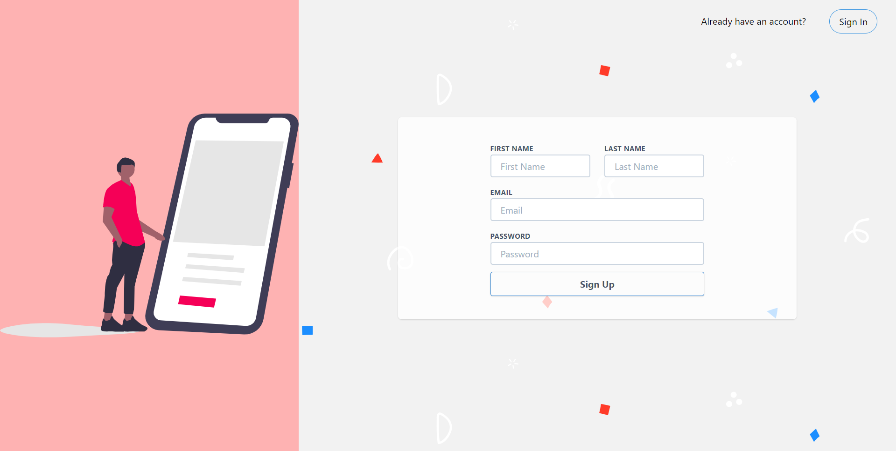

# Twitter Inspired Social App
Social media app (Work in progress) created using React, React-Redux, Firebase and Tailwind css

Hosted URL: [Let's go there](https://social-app.musa-bello.vercel.app/)

Just in case you feel signing up will be tedious, use the login details below
email: mbibrahim.4@gmail.com
password: password

<p align="center">
  
</p>


## Development

To get a local copy of the code, clone it using git:

```
git clone https://github.com/musa-bello/signup-mock
cd signup-mock
```

Install dependencies:

```
npm install
```

Finally, you need to start a local web server. Run:

```
npm start

Runs the app in the development mode.<br />
Open [http://localhost:3000](http://localhost:3000) to view it in the browser.

The page will reload if you make edits.<br />
You will also see any lint errors in the console.
```
